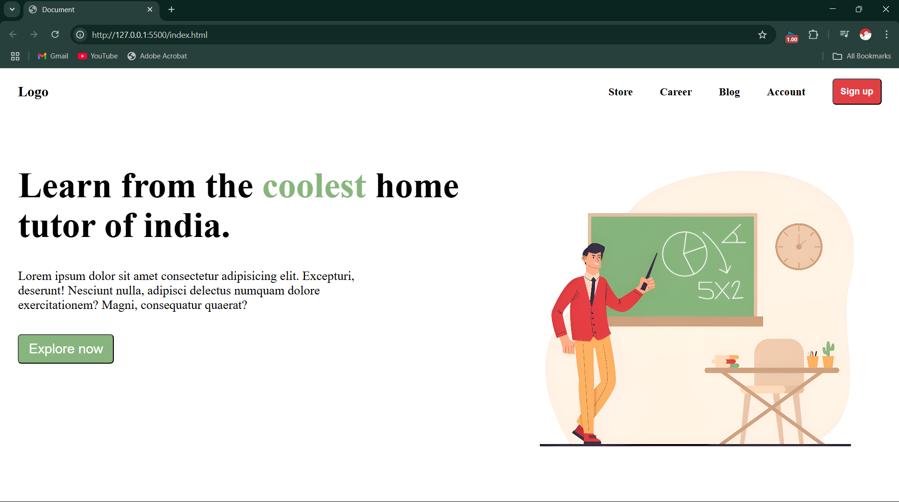
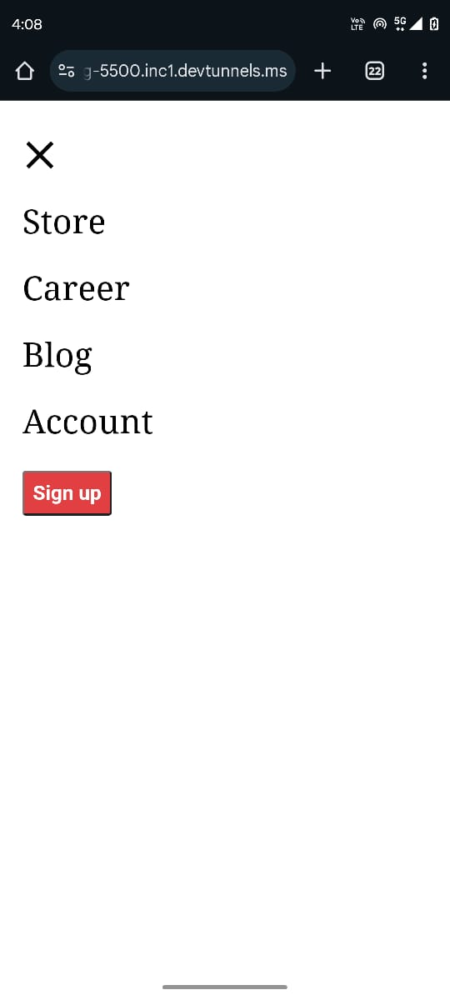

# Responsive Landing Page

This is a fully responsive landing page built using **HTML, CSS, and JavaScript**. It is designed to adapt seamlessly to all screen sizes, ensuring a smooth user experience on desktops, tablets, and mobile devices.

## Features
- **Responsive Navbar** with an opening and closing menu function.
- **Modern UI Design** with clean and structured code.
- **Smooth User Experience** across all screen sizes.
- **Easy to Run** using Live Server in VS Code.

## How to Run the Project
1. **Clone the repository** (if applicable) or download the project files.
   ```sh
   git clone https://github.com/codefixxx/minimalistic-landing-page.git
   cd basic responsive landing page
   ```
2. **Open the project in VS Code**.
3. **Install Live Server Extension** (if not already installed).
4. **Right-click `index.html`** and select **"Open with Live Server"**.
5. The landing page will now be running in your default web browser.

## Technologies Used
- **HTML** for the structure.
- **CSS** for styling and responsiveness.
- **JavaScript** for interactive functionality (navbar toggle, etc.).

## Screenshots

### 📌 Desktop View


### 📌 Mobile View


### 📌 Mobile Menu View



## License
This project is open-source under the **MIT License**.

---
Feel free to modify and improve the landing page as needed. Happy coding! 🚀

